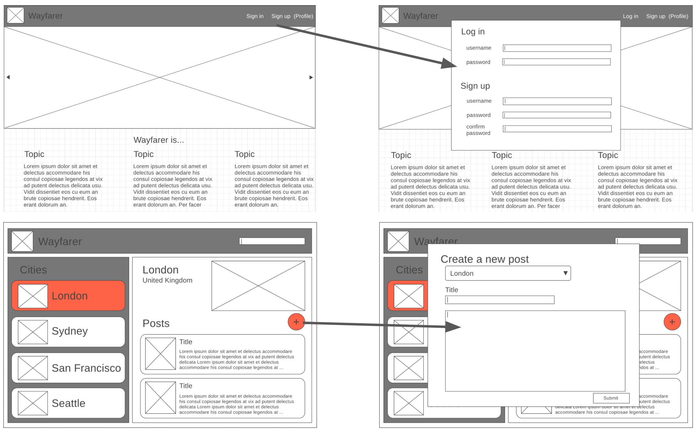
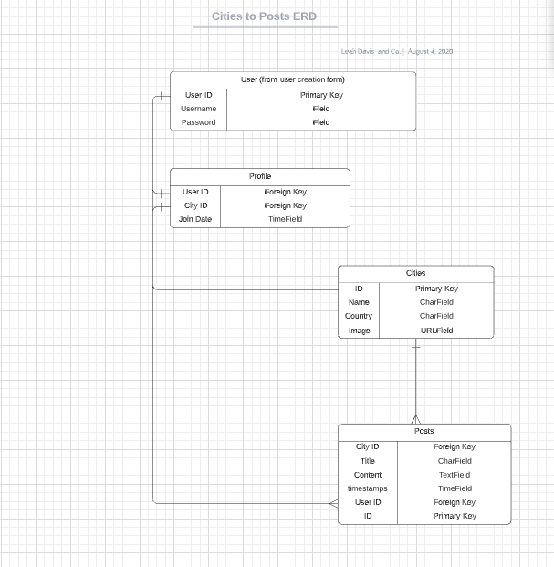

# Wayfayer

A full-stack international travel blog where users can create, edit, and delete posts for the cities they visit around the world.

# User Stoires

## PART A (Basic Auth & Profile):
**A user should be able to:**

1. Navigate to "/" and see a basic splash page with:
- The name of the website.
- Links to "Log In" and "Sign Up".
2. Sign up for an account.
3. Log in to their account if they already have one.
4. Be redirected to their public profile page after logging in.
5. On their public profile page, see their name, the current city they have set in their profile, and their join date.
6. See the site-wide header on every page with:
- A link to "Log Out" if they're logged in.
- Links to "Log In" and "Sign Up" if they're logged out.
7. Update their profile by making changes to their name and/or current city.
8. See the titles of all the posts they've contributed (start with pre-seeded data).
9. Click on the title of one of their posts and be redirected to a "show" page for that post.
10. View post "show" pages with title, author, and content.

### Extras
**A user should be able to:**
1. See a "default" profile photo on their profile page before adding their own photo.
2. Update their profile photo (consider using Paperclip or Uploadcare).
3. See their profile photo next to their posts.
4. Receive a welcome email after creating an account.

## PART B: CRUD
**A user should be able to:**

1. View the "San Francisco" page (at "/cities/1") including:
- The site-wide header.
- The name of the city.
- An iconic photo of the city.
2. View a list of posts on the San Francisco page:
- Sorted by newest first.
- With the post titles linked to the individual post "show" pages.
3. Use an "Add New Post" button on the San Francisco city page to pull up the new post form.
4. Create a new post for San Francisco.
5. Click "Edit" on ANY individual post, and be redirected to the edit form.
6. Click "delete" on ANY individual post, then:
- See a pop-up that says: "Are you sure you want to delete #{title}?"
- If the user confirms, delete the post.

### Extras
**On a city's page a user should be able to:**
- See post content truncated to 1000 characters max, with a link to view more.

## PART C: Validations & Authorization
**A user should be able to:**
1. View city pages for "London" and "Gibraltar".
2. Verify that a new post they create is successfully published on the correct city page.

A user CANNOT save invalid data to the database, according to the following rules:
3. A user CANNOT sign up with an email (or username) that is already in use.
4. A post's title must be between 1 and 200 characters.
5. A post's content must not be empty.

A user is authorized to perform certain actions on the site, according to the following rules:
6. A user MUST be logged in to create/update/destroy resources.
7. A user may only edit their own profile and edit/delete their own posts.

#### Extras
**A user should be able to:**
1. See a list of the city pages they've contributed to, on their public profile
2. See the number of posts they've written for each city, next to the city's name in their profile.

# Client Wireframes

# Entity Relationship Diagram (ERD)

# Technologies Used

- Python
- Django
- Terminal
- JavaScript
- CSS
- HTML
- Github
- PostgreSQL

# Existing Features

- welcome email upon signing up
- secure login/logout
- user authentication
- navigation bar
- user profile 
- user's can see the travel blog posts of fellow users.
- user's can only edit/delete their own posts while logged in
- image uploads identified with user profiles and posts

